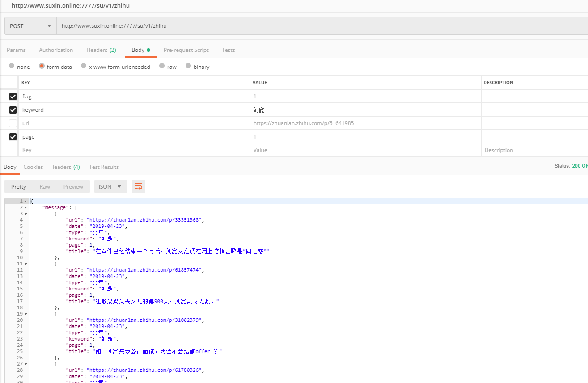
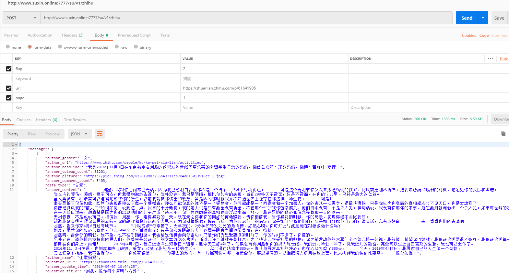

[](https://www.python.org/downloads/)
[](https://saythanks.io/to/ResolveWang)
[](LICENSE)

## 项目亮点 :star:
- 功能全面：
    - 现已完成 **知乎** 相关数据抓取  
      - **关键词抓取问题**
      - **URL抓取问题相关回答信息**
      
- 数据全面：**逐渐实现主流网站各个层次不同的数据抓取需求**
             
- 稳定！**项目可以长期稳定运行**。
  - 为了保证程序能长期稳定运行，数据所有的网络请求都是通过抓包手动分析的，未用任何自动化工具，包括模拟登陆！
做二次开发，项目已经在微博数据采集和模版解析上做了大量工作。
- 便捷
    - 不需要任何代码配置。提供测试账号，直接调用api即可获取数据。
- 该项目会长期更新。
- 欢迎提issue，维护者看到后都会积极回答。

## 快速开始 :octocat:

1.登录

- 提供测试账号   
  - username: **c6552326a848ac876cd43b5da0440d13bd7d58e8**
  - password: **95df21c0c556bfcde96b61775588377f**
>     http://www.suxin.online:7777/su/v1/login   
```
post 方法    获取认证token

data:
    username
    password
    
```

2.知乎
>     http://www.suxin.online:7777/su/v1/login   post 方法 
```
**headers附带认证token信息**

知乎搜索页根据关键词返回 相关问题信息  
data:
    flas:1
    keyword:
    page:
headers:
    Authorization:   

知乎根据问题url 返回 所有回答信息  
data:
    flas:2
    url:
    page:
headers:
    Authorization:   
```



3.待更新

## 重要声明 :loudspeaker:
该项目开发的初衷是为了对部分信息进行监控，并且获取一些自然语言处理所需的语料，在**数据抓取的时候对爬虫访问频率进行了较为严格的控制**。


